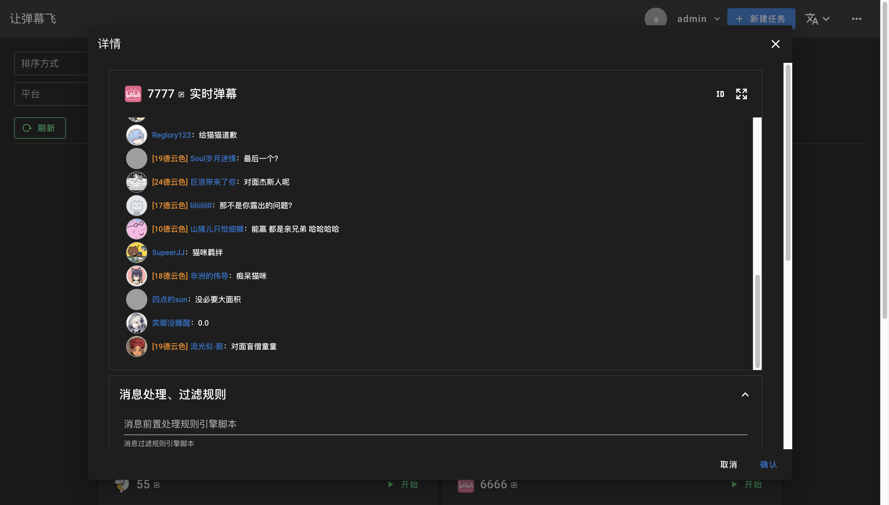
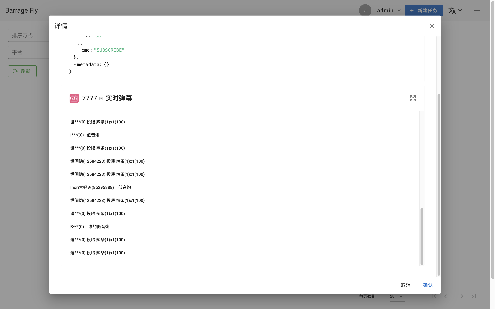
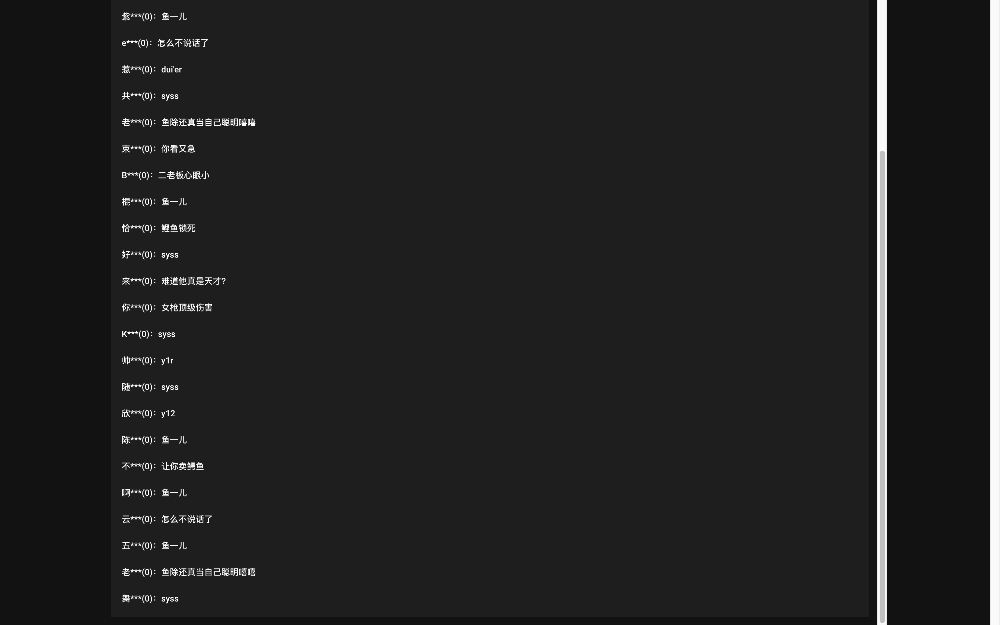
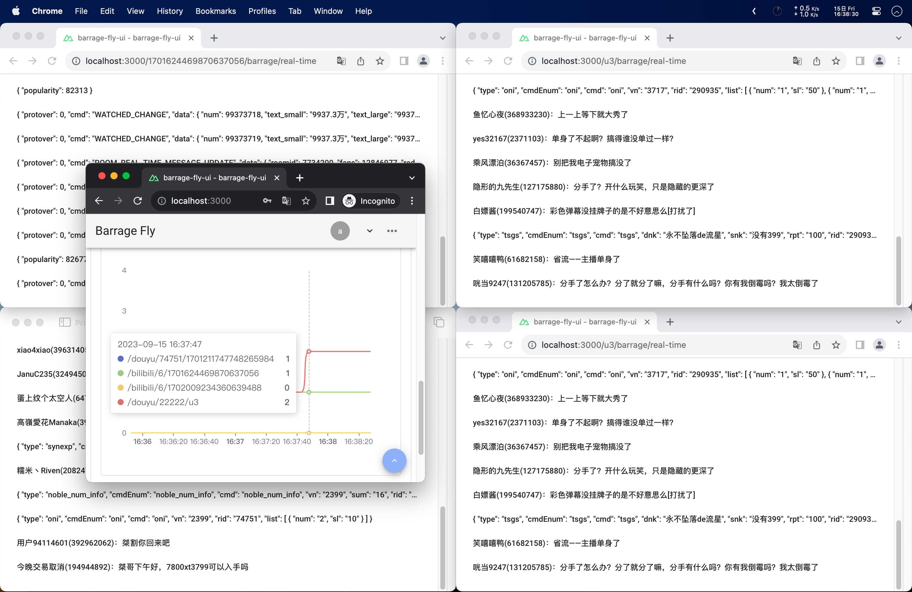

# barrage-fly 让弹幕飞

   

一个弹幕转发、过滤、处理平台

## 1 项目简介

### 1.1 功能

1. 监听不同平台不同直播间的弹幕，支持B站、斗鱼、虎牙、抖音、快手
2. 使用统一的协议将弹幕转发出去，DANMU、GIFT、SUPER_CHAT、ENTER_ROOM、LIKE、LIVE_STATUS_CHANGE、ROOM_STATS、SOCIAL
3. 支持弹幕流的过滤与转换，前置处理、消息过滤、后置处理、弹幕发送*
4. 内置简易实时弹幕显示、实时任务状态统计

> *弹幕发送存在平台差异，详见 https://github.com/OrdinaryRoad-Project/ordinaryroad-live-chat-client?tab=readme-ov-file#平台适配情况表

|               |  |  |
|---------------------------------------------------------------------------------------|-----------------------------------------------------------------------------------|-----------------------------------------------------------------------------------|
|  |        |        |

### 1.2 作用

屏蔽不同平台直播平台弹幕协议的差异，便于开发其他与弹幕相关的应用：实时弹幕大屏、弹幕互动、弹幕存档、弹幕分析、弹幕词云图等

### 1.3 相关技术栈

- [Netty](https://netty.io)
- [Spring WebFlux](https://docs.spring.io/spring-framework/reference/web/webflux.html)
- [RSocket](https://rsocket.io)
- [QLExpress](https://github.com/alibaba/QLExpress)

## 2 项目部署

项目前后端分离，可以使用Docker Compose进行部署，或者clone项目到本地后分别打包后部署

> 如需协助部署，请前往频道联系频道主

- 演示DEMO：[https://barragefly.demo.ordinaryroad.tech](https://barragefly.demo.ordinaryroad.tech)
- WebSocket地址：wss://barragefly-rsocket.demo.ordinaryroad.tech

> 帐号请前往[QQ频道](https://pd.qq.com/s/3id0n7fvs)获取
> 

## 3 在线文档

[https://barragefly.ordinaryroad.tech](https://barragefly.ordinaryroad.tech)

## 交流讨论

扫描二维码加入QQ/微信频道，或点击链接加入QQ频道【OrdinaryRoad】：https://pd.qq.com/s/3id0n7fvs

## 捐赠

> 开源不易，您的认可与支持是我不断更新的最大动力！
>
> 

## 其他

- [ordinaryroad-live-chat-client](https://github.com/OrdinaryRoad-Project/ordinaryroad-live-chat-client)

## 免责声明

免责声明：仅供学术研究使用。对于违反相关法律、造成危害的滥用行为，开发者不负任何责任。
