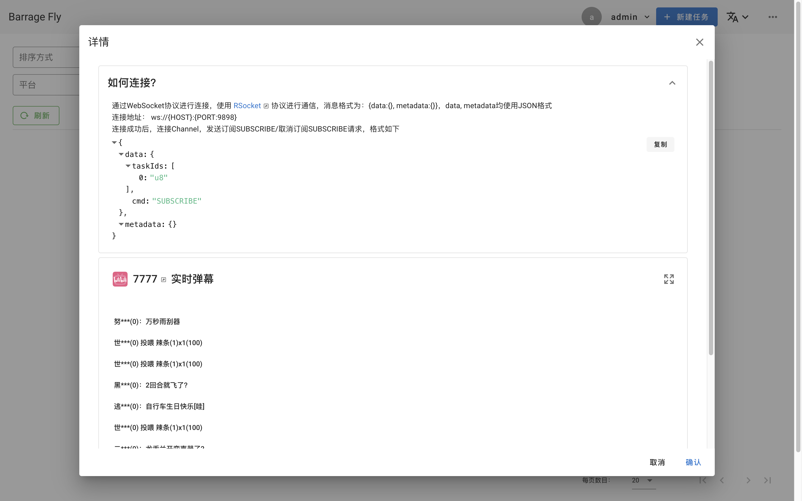
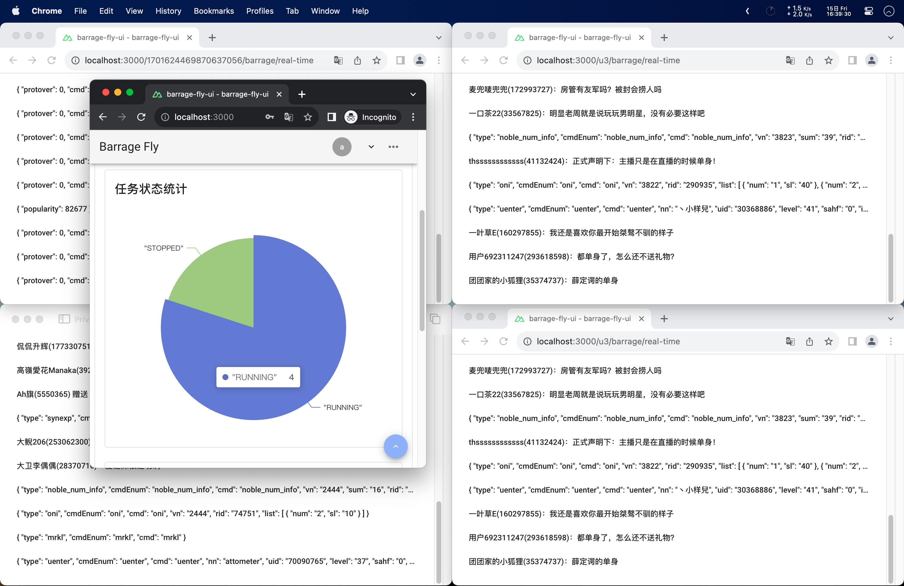

# barrage-fly 让弹幕飞

一个弹幕转发平台

[在线文档](https://ordinaryroad.tech/or_module/barrage-fly/)

## 1 项目简介

### 1.1 功能

1. 监听不同平台直播间的弹幕
2. 使用统一的协议将弹幕转发出去
3. 内置简易实时弹幕显示

|               |  |  |
|------------------------------------------------------|--------------------------------------------------|--------------------------------------------------|
|  |        |        |

### 1.2 作用

屏蔽不同平台直播平台弹幕协议的差异，便于开发其他与弹幕相关的应用：实时弹幕大屏、弹幕互动、弹幕存档、弹幕分析、弹幕词云图等

### 1.3 相关技术栈

- [Netty](https://netty.io)
- [Spring WebFlux](https://docs.spring.io/spring-framework/reference/web/webflux.html)
- [RSocket](https://rsocket.io)
- [QLExpress](https://github.com/alibaba/QLExpress)

## 2 项目部署

项目前后端分离，可以使用Docker Compose进行部署，或者分别打包后部署

### 2.1 Docker Compose

> Docker Compose示例位于`.docker`目录中

- arm64系统时，后端镜像请使用 `ordinaryroad-barrage-fly-arm64`
- 使用mysql、nginx时需要先build
    - `docker compose build ordinaryroad-barrage-fly-mysql`
    - `docker compose build ordinaryroad-barrage-fly-nginx`
- 在线生成RSA密钥对：https://www.bejson.com/enc/rsa/ （不需要-----BEGIN PUBLIC KEY-----）

> 镜像加速与拉取
> ```shell
> # DOCKER_OPTS="--registry-mirror=https://mirror.ccs.tencentyun.com"
> docker pull ordinaryroad-docker.pkg.coding.net/ordinaryroad-barrage-fly/docker-pub/ordinaryroad-barrage-fly:$APP_VERSION
> docker pull ordinaryroad-docker.pkg.coding.net/ordinaryroad-barrage-fly/docker-pub/ordinaryroad-barrage-fly-arm64:$APP_VERSION
> docker pull ordinaryroad-docker.pkg.coding.net/ordinaryroad-barrage-fly/docker-pub/ordinaryroad-barrage-fly-ui:$APP_VERSION
> ```

#### 2.1.1 前端+后端

```yaml
# 需要的环境变量，其他可以环境变量可看每个目录下的.env文件，初始化sql位于`.docker/ordinaryroad-barrage-fly-mysql/sql/or_barrage_fly.sql`
# MYSQL_HOST（注意请勿用localhost、127.0.0.1）
# MYSQL_PORT
# MYSQL_DATABASE
# MYSQL_USERNAME
# MYSQL_PASSWORD
# SUB_BASE_URL（根据后端部署情况设置Client要连接的地址）
# RSA_PUBLIC_KEY（RSA）
# ADMIN_USERNAME（任务管理后台登录用户名）
# ADMIN_PASSWORD（任务管理后台登录密码）
# RSA_PRIVATE_KEY（RSA）

version: "3.0"
services:
  ordinaryroad-barrage-fly-ui:
    image: ordinaryroad-barrage-fly-ui
    container_name: ordinaryroad-barrage-fly-ui
    build:
      context: ./ordinaryroad-barrage-fly-ui
    volumes:
      - $PWD/ordinaryroad-barrage-fly-ui/app:/ordinaryroad/ordinaryroad-barrage-fly-ui/app
    environment:
      BASE_URL: http://ordinaryroad-barrage-fly:8080
      RSA_PUBLIC_KEY:
      SUB_BASE_URL:
    ports:
      - "30000:3000"
    hostname: ordinaryroad-barrage-fly-ui
    restart: always

  ordinaryroad-barrage-fly:
    image: ordinaryroad-barrage-fly
    container_name: ordinaryroad-barrage-fly
    build:
      context: ./ordinaryroad-barrage-fly
    environment:
      MYSQL_HOST:
      MYSQL_PORT:
      MYSQL_DATABASE:
      MYSQL_USERNAME:
      MYSQL_PASSWORD:
      ADMIN_USERNAME:
      ADMIN_PASSWORD:
      RSA_PUBLIC_KEY:
      RSA_PRIVATE_KEY:
    ports:
      - "9898:9898"
    hostname: ordinaryroad-barrage-fly
    restart: always
```

#### 2.1.2 前端+后端+MySQL

```yaml
# 需要的环境变量，其他可以环境变量可看每个目录下的.env文件
# MYSQL_ROOT_PASSWORD（MySQL初始ROOT密码）
# SUB_BASE_URL（根据后端部署情况设置Client要连接的地址）
# RSA_PUBLIC_KEY（RSA）
# ADMIN_USERNAME（任务管理后台登录用户名）
# ADMIN_PASSWORD（任务管理后台登录密码）
# RSA_PRIVATE_KEY（RSA）

version: "3.0"
services:
  ordinaryroad-barrage-fly-mysql:
    image: ordinaryroad-barrage-fly-mysql
    container_name: ordinaryroad-barrage-fly-mysql
    build:
      context: ./ordinaryroad-barrage-fly-mysql
    volumes:
      - $PWD/ordinaryroad-barrage-fly-mysql/etc/my.cnf:/etc/my.cnf
      - $PWD/ordinaryroad-barrage-fly-mysql/data:/var/lib/mysql
    environment:
      MYSQL_ROOT_PASSWORD:
    ports:
      - "33066:3306"
    hostname: ordinaryroad-barrage-fly-mysql
    restart: always

  ordinaryroad-barrage-fly-ui:
    image: ordinaryroad-barrage-fly-ui
    container_name: ordinaryroad-barrage-fly-ui
    build:
      context: ./ordinaryroad-barrage-fly-ui
    volumes:
      - $PWD/ordinaryroad-barrage-fly-ui/app:/ordinaryroad/ordinaryroad-barrage-fly-ui/app
    environment:
      BASE_URL: http://ordinaryroad-barrage-fly:8080
      RSA_PUBLIC_KEY:
      SUB_BASE_URL:
    ports:
      - "30000:3000"
    hostname: ordinaryroad-barrage-fly-ui
    restart: always

  ordinaryroad-barrage-fly:
    image: ordinaryroad-barrage-fly
    container_name: ordinaryroad-barrage-fly
    build:
      context: ./ordinaryroad-barrage-fly
    environment:
      MYSQL_USERNAME: root
      MYSQL_PASSWORD: ${MYSQL_ROOT_PASSWORD}
      ADMIN_USERNAME:
      ADMIN_PASSWORD:
      RSA_PUBLIC_KEY:
      RSA_PRIVATE_KEY:
    ports:
      - "9898:9898"
    hostname: ordinaryroad-barrage-fly
    restart: always
```

#### 2.1.3 前端+后端+MySQL+Nginx

```yaml
# 需要的环境变量，其他可以环境变量可看每个目录下的.env文件
# MYSQL_ROOT_PASSWORD（MySQL初始ROOT密码）
# SUB_BASE_URL（根据后端部署情况设置Client要连接的地址）
# RSA_PUBLIC_KEY（RSA）
# ADMIN_USERNAME（任务管理后台登录用户名）
# ADMIN_PASSWORD（任务管理后台登录密码）
# RSA_PRIVATE_KEY（RSA）

version: "3.0"
services:
  ordinaryroad-barrage-fly-mysql:
    image: ordinaryroad-barrage-fly-mysql
    container_name: ordinaryroad-barrage-fly-mysql
    build:
      context: ./ordinaryroad-barrage-fly-mysql
    volumes:
      - $PWD/ordinaryroad-barrage-fly-mysql/etc/my.cnf:/etc/my.cnf
      - $PWD/ordinaryroad-barrage-fly-mysql/data:/var/lib/mysql
    environment:
      MYSQL_ROOT_PASSWORD:
    hostname: ordinaryroad-barrage-fly-mysql
    restart: always

  ordinaryroad-barrage-fly-ui:
    image: ordinaryroad-barrage-fly-ui
    container_name: ordinaryroad-barrage-fly-ui
    build:
      context: ./ordinaryroad-barrage-fly-ui
    volumes:
      - $PWD/ordinaryroad-barrage-fly-ui/app:/ordinaryroad/ordinaryroad-barrage-fly-ui/app
    environment:
      BASE_URL: http://ordinaryroad-barrage-fly:8080
      RSA_PUBLIC_KEY:
      SUB_BASE_URL:
    hostname: ordinaryroad-barrage-fly-ui
    restart: always

  ordinaryroad-barrage-fly:
    image: ordinaryroad-barrage-fly
    container_name: ordinaryroad-barrage-fly
    build:
      context: ./ordinaryroad-barrage-fly
    environment:
      MYSQL_USERNAME: root
      MYSQL_PASSWORD: ${MYSQL_ROOT_PASSWORD}
      ADMIN_USERNAME:
      ADMIN_PASSWORD:
      RSA_PUBLIC_KEY:
      RSA_PRIVATE_KEY:
    hostname: ordinaryroad-barrage-fly
    restart: always

  ordinaryroad-barrage-fly-nginx:
    image: ordinaryroad-barrage-fly-nginx
    container_name: ordinaryroad-barrage-fly-nginx
    build:
      context: ./ordinaryroad-barrage-fly-nginx
    ports:
      - "81:81"
      - "9898:9898"
    hostname: ordinaryroad-barrage-fly-nginx
    restart: always
```

#### 2.1.4 Example

```properties
# .env
MYSQL_HOST=192.168.1.2
MYSQL_PORT=3306
MYSQL_DATABASE=or_barrage_fly
MYSQL_USERNAME=root
MYSQL_PASSWORD=root
SUB_BASE_URL=ws://ordinaryroad-barrage-fly:9898
RSA_PUBLIC_KEY=MIGfMA0GCSqGSIb3DQEBAQUAA4GNADCBiQKBgQDNqVTCHbPojzNaR5TwhFxeKcuP/Po4J8WAc5dz1pHQ8FasH/hrSWwoFGpTTo6tfTl0mnAotu4p93kSMe+K2pc2VqUJwCcFj9cD6rhaKfjdj7/Kd2rHH43mXPI+OtggzzOKOOPsaMP5/r2Dyooafa1ChYDuSmf2fDM53CSIx+KDUwIDAQAB
ADMIN_USERNAME=admin
ADMIN_PASSWORD=admin
RSA_PRIVATE_KEY=MIICeAIBADANBgkqhkiG9w0BAQEFAASCAmIwggJeAgEAAoGBAM2pVMIds+iPM1pHlPCEXF4py4/8+jgnxYBzl3PWkdDwVqwf+GtJbCgUalNOjq19OXSacCi27in3eRIx74ralzZWpQnAJwWP1wPquFop+N2Pv8p3ascfjeZc8j462CDPM4o44+xow/n+vYPKihp9rUKFgO5KZ/Z8MzncJIjH4oNTAgMBAAECgYEAs+ttoRzHJa8Rp+tzmy7Qd/hsg503ciUpHYUCfG68xmNcD90wQPvMyQuDMTpKi/A/cYkikhvnI4PCwW46N+mf2nJZEYG1DARTVj0lWaW+RqzerXG1Jg6v1WbgJwy5myZhFm9AOSb0OW3HskbRRyqxkiFX2Fr7ZKYXfrIWvooiVWECQQDnc0PPBpl5XPB+yGKepEatRwCMKdoIoD3R96Iykq9xowskafwob+gOn3mqEiH8YuDPOntcC4tqeLSzNiHYftKpAkEA43nN5SqvJZ3Gp/Vm4VY7DRAAT4cCxcxyYy3p1iuZf19y0UGdRrURQl4jx+I9RGSIy4v/hfpU05wnecvLh3KfmwJBANUz1pjUSXgEZv1C9aWRShHAP/7dZp1fjtLlvCG+AaM6P79RahiNzUP7H4XMokXth40dIBmQAOMZQct75/2YBdECQQCpwP0Y1pir/qkAME8dO+eHYPiKYJt+FosKXnoRXKoI9qbNaCTBXmBJ4czb3oaQImI/W/NM/ToOTIrdBmuVYcGfAkA6bkUO1fjjSC8N00xX1uGxJTcWwd9MQAffS+jm+C69lOyNW/azJjgXnmkbjKKB0kDcMDn6bkuYblcm4GOrVhqA
```

```yaml
# compose.yaml
version: "3.0"
services:
  ordinaryroad-barrage-fly-ui:
    image: ordinaryroad-barrage-fly-ui
    container_name: ordinaryroad-barrage-fly-ui
    build:
      context: ./ordinaryroad-barrage-fly-ui
    environment:
      BASE_URL: http://ordinaryroad-barrage-fly:8080
      RSA_PUBLIC_KEY:
      SUB_BASE_URL:
    ports:
      - "30000:3000"
    hostname: ordinaryroad-barrage-fly-ui
    restart: always

  ordinaryroad-barrage-fly:
    image: ordinaryroad-barrage-fly-arm64
    container_name: ordinaryroad-barrage-fly
    build:
      context: ./ordinaryroad-barrage-fly
    environment:
      MYSQL_HOST:
      MYSQL_PORT:
      MYSQL_DATABASE:
      MYSQL_USERNAME:
      MYSQL_PASSWORD:
      ADMIN_USERNAME:
      ADMIN_PASSWORD:
      RSA_PUBLIC_KEY:
      RSA_PRIVATE_KEY:
    ports:
      - "9898:9898"
    hostname: ordinaryroad-barrage-fly
    restart: always
```

## 3 如何连接

大体上分别为三步

1. 创建Client，与Server建立连接
2. Client请求Channel，并发送要订阅/取消订阅的任务ID（直播间弹幕转发任务）
3. 监听Server通过Channel回复的消息（转发过来的直播间弹幕）

> 浏览器环境用WebSocket，其他环境可以用TCP

在 `connector-examples` 目录下提供了一些不同语言的例子可供参考

- python
    - [x] websocket
- vue参考`barrage-fly-ui/components/or/barrage/fly/task/RealTimeBarrage.vue`

## 4 如何配置消息的过滤与转换

> QLExpress相关说明

- 支持的方法
    - 各种静态方法一般都可以用（需要先import）
        - [Hutool](https://www.hutool.cn/docs)
    - 向上下文添加变量 contextPut(key, value)
        - 添加后可直接通过key访问
    - 发送弹幕 sendDanmu(taskId, danmu)
        - 别名：发送弹幕(taskId, danmu)
        - 任务必须正在运行中，弹幕内容String
    - 获取任务详情 getTask(taskId)

> 消息封装类`BarrageFlyMsgDTO`简介

| 变量名称     | 含义                     | 类型     | 备注                                                                                                                                                                                                                                                                                                                                                                                                                                                              |
|----------|------------------------|--------|-----------------------------------------------------------------------------------------------------------------------------------------------------------------------------------------------------------------------------------------------------------------------------------------------------------------------------------------------------------------------------------------------------------------------------------------------------------------|
| platform | 消息所属平台                 | String | BILIBILI/DOUYU                                                                                                                                                                                                                                                                                                                                                                                                                                                  |
| roomId   | 消息所属直播间房间号             | String |                                                                                                                                                                                                                                                                                                                                                                                                                                                                 |
| type     | 框架定义的消息类型，提供了一些通用的属性   | String | [DANMU](https://github.com/OrdinaryRoad-Project/ordinaryroad-live-chat-client/blob/main/live-chat-client-commons/live-chat-client-commons-base/src/main/java/tech/ordinaryroad/live/chat/client/commons/base/msg/IDanmuMsg.java)/[GIFT](https://github.com/OrdinaryRoad-Project/ordinaryroad-live-chat-client/blob/main/live-chat-client-commons/live-chat-client-commons-base/src/main/java/tech/ordinaryroad/live/chat/client/commons/base/msg/IGiftMsg.java) |
| msg      | 收到的原始消息，不同平台不同消息类型字段不同 | IMsg   | [ordinaryroad-live-chat-client](https://github.com/OrdinaryRoad-Project/ordinaryroad-live-chat-client)                                                                                                                                                                                                                                                                                                                                                          |

### 4.1 前置操作

#### 4.1.1 方法参数

msg: `BarrageFlyMsgDTO`，框架对消息的简单封装

#### 4.1.2 方法返回值

`Object?`，为空默认返回入参`msg`

### 4.2 过滤

#### 4.2.1 方法参数

msg: `Object`，前置操作的返回值

#### 4.2.2 方法返回值

`Boolean`，`false`表示丢弃此消息；`true`表示需要该消息，并继续进行后置处理

### 4.3 后置操作

#### 4.3.1 方法参数

msg: `Object`，前置处理的返回值

#### 4.3.2 方法返回值

`Object?`，Client最终将会收到的消息，为空默认返回入参`msg`

### 4.4 一些例子

#### 4.4.1 只接收框架定义的消息

```
return msg.type != null
```

#### 4.4.2 封装msg，增加随机数

```
import cn.hutool.core.util.RandomUtil;

map = new HashMap(2);
map.put("originalMsg",msg);
map.put("randomNumber",RandomUtil.randomNumbers(6));
return map;
```

#### 4.4.3 通过Http请求获取某个任务的信息，并扩充到msg中

```
import cn.hutool.http.HttpUtil;
import cn.hutool.core.bean.BeanUtil;

task = HttpUtil.createGet("http://localhost:8080/task?id=1701211747748265984").execute().body();
map = BeanUtil.beanToMap(msg, false, false);
map.put("task",task);
return map;
```

#### 4.4.4 收到消息后发送弹幕

```
import cn.hutool.core.util.RandomUtil;

/**随机发送弹幕**/
if RandomUtil.randomInt(0,10) > 6
then
   发送弹幕("u2","666666"+RandomUtil.randomNumbers(1));

return msg
```

#### 4.4.5 获取任务详情

```
import cn.hutool.core.bean.BeanUtil;

map = BeanUtil.beanToMap(msg, false, false);
map.put("task",getTask("taskId"));

return map;
```

## 其他

- [ordinaryroad-live-chat-client](https://github.com/OrdinaryRoad-Project/ordinaryroad-live-chat-client)

## 免责声明

免责声明：仅供学术研究使用。对于违反相关法律、造成危害的滥用行为，开发者不负任何责任。